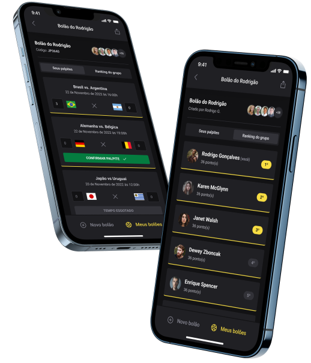

  

## Projeto

Aplicação que simula a criação e participação de pessoas, autenticadas, em bolões da Copa do Mundo de 2022.

<!-- 

  
  

 -->

### Layout

Você pode visualizar o layout do projeto por [aqui](<https://www.figma.com/file/628h9hw5MZ4Hwx8e64fABq/Bol%C3%A3o-da-Copa-(Community)?node-id=36%3A2213>).

## Tenologias

- [Expo](https://docs.expo.dev/)
- [Fastify](https://www.fastify.io/)
- [NextJS](https://nextjs.org/)
- [ReactJS](https://reactjs.org/)
- [React Native](https://reactnative.dev/)
- [Prisma](https://www.prisma.io/)
- [Typescript](https://www.typescriptlang.org/)

## Como executar

Cada pasta contém um projeto. Para executar cada projeto, é necessário instalar os pacotes com o gerenciador de sua preferência. Para isso, acesse a documentação de cada projeto, a seguir:

- [Mobile](mobile/README.md)
- [Server](server/README.md)
- [Web](web/README.md)

## License

Esse projeto está sob a licença MIT. Acesse o arquivo [LICENSE](LICENCE) para mais detalhes.
